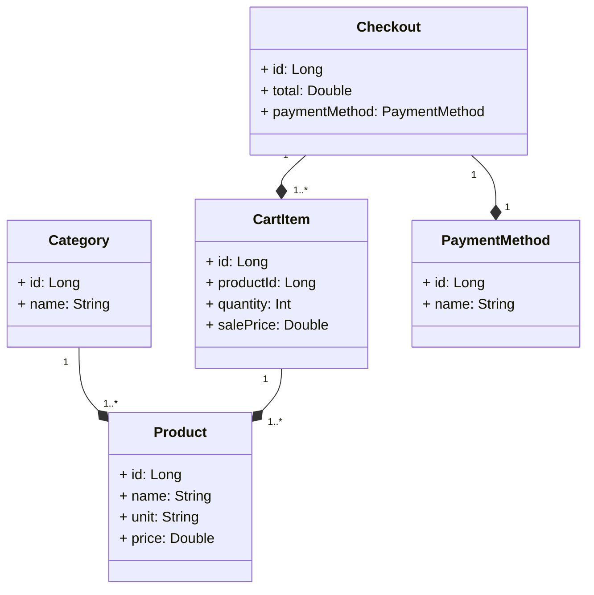

# Este é um projeto de Autoatendimento para uma mercearia.

Este projeto é um sistema para o funcionamento de um auto atendimento de uma mercearia. O objetivo é permitir que os clientes façam suas compras de forma autônoma, escolhendo os produtos, adicionando-os ao carrinho de compras, e realizando o pagamento de forma rápida e prática. O sistema é desenvolvido em Kotlin utilizando o Spring Framework.

# Estrutura do Projeto
O projeto é organizado em pacotes, cada um com responsabilidades específicas. A seguir, apresentamos uma visão geral dos pacotes e suas respectivas classes:

## Diagrama UML

## Pacote: com.atendimento.market.controller

Este pacote contém as classes que atuam como controladores do sistema, responsáveis por receber as requisições HTTP dos clientes e encaminhá-las para as respectivas camadas de serviço.

### CartController.kt

Controlador responsável por gerenciar o carrinho de compras. Possui endpoints para adicionar itens ao carrinho, remover itens, obter informações de um item específico e listar todos os itens do carrinho.

### CategoryController.kt

Controlador responsável por gerenciar as categorias de produtos. Contém endpoints para criar, obter, atualizar e excluir categorias.

### CheckoutController.kt

Controlador responsável por gerenciar o checkout do cliente. Fornece endpoints para finalizar o checkout, atualizar o método de pagamento e obter informações sobre um checkout específico, além de listar todos os checkouts realizados.

### ProductController.kt

Controlador responsável por gerenciar os produtos disponíveis na mercearia. Oferece endpoints para criar, obter, atualizar e excluir produtos, além de listar todos os produtos cadastrados.

## Pacote: com.atendimento.market.dto

Neste pacote estão localizadas as classes de transferência de dados (DTOs) usadas para representar os objetos transferidos entre a camada de controle e a camada de serviço.

### CartItemDTO.kt

DTO para representar um item adicionado ao carrinho de compras. Contém informações como o ID do produto, quantidade e preço de venda.

### CategoryDTO.kt

DTO para representar uma categoria de produto. Possui um único atributo "name" que representa o nome da categoria.

### CheckoutRequestDTO.kt

DTO usado para receber informações sobre o checkout do cliente. Contém o valor total da compra e o método de pagamento escolhido.

### ProductDTO.kt

DTO para representar um produto. Possui atributos como o ID, nome, unidade de medida, preço e ID da categoria à qual o produto pertence.

## Pacote: com.atendimento.market.enum

Este pacote contém as enumerações usadas no sistema.

### PaymentMethod.kt

Enumeração que representa os métodos de pagamento disponíveis, como cartão de crédito, cartão de débito, dinheiro e PIX.

## Pacote: com.atendimento.market.exception

Neste pacote, encontra-se a classe GlobalExceptionHandler.kt, que é uma classe auxiliar para lidar com exceções em nível global. Ela intercepta e trata diferentes tipos de exceções, retornando respostas adequadas para os clientes.

## Pacote: com.atendimento.market.model

Este pacote contém as classes que representam as entidades do sistema.

### CartItem.kt

Classe que representa um item do carrinho de compras. Armazena informações como o ID do item, o ID do produto, quantidade e preço de venda.

### Category.kt

Classe que representa uma categoria de produto. Contém o ID da categoria e o nome da categoria.

### Checkout.kt

Classe que representa um checkout finalizado. Armazena informações como o ID do checkout, o valor total da compra e o método de pagamento escolhido.

### Product.kt

Classe que representa um produto disponível na mercearia. Contém atributos como o ID do produto, nome, unidade de medida, preço e uma associação com a categoria do produto.

## Pacote: com.atendimento.market.repository

Este pacote contém as interfaces de repositório, que definem as operações de acesso a banco de dados para cada entidade.

### CartItemRepository.kt

Interface de repositório para a entidade CartItem.

### CategoryRepository.kt

Interface de repositório para a entidade Category.

### CheckoutRepository.kt

Interface de repositório para a entidade Checkout.

### ProductRepository.kt

Interface de repositório para a entidade Product.

## Pacote: com.atendimento.market.service

Este pacote contém as classes de serviço, que implementam a lógica de negócio do sistema.

### CartService.kt

Classe de serviço responsável por gerenciar o carrinho de compras. Contém métodos para adicionar e remover itens do carrinho, obter informações sobre um item específico e listar todos os itens do carrinho.

### CategoryService.kt

Classe de serviço responsável por gerenciar as categorias de produtos. Implementa métodos para criar, obter, atualizar e excluir categorias.

### CheckoutService.kt

Classe de serviço responsável por gerenciar o checkout do cliente. Possui métodos para finalizar o checkout, atualizar o método de pagamento e obter informações sobre um checkout específico, além de listar todos os checkouts realizados.

### ProductService.kt

Classe de serviço responsável por gerenciar os produtos disponíveis na mercearia. Implementa métodos para criar, obter, atualizar e excluir produtos, além de listar todos os produtos cadastrados.

# Funcionalidades

**1. Gerenciamento de Categorias:**
- Criar uma nova categoria.
- Obter informações de uma categoria existente por ID.
- Atualizar informações de uma categoria existente.
- Excluir uma categoria.

**2. Gerenciamento de Produtos:**
- Criar um novo produto associado a uma categoria específica.
- Obter informações de um produto existente por ID.
- Obter informações de todos os produtos disponíveis.
- Atualizar informações de um produto existente.
- Excluir um produto.

**3. Gerenciamento do Carrinho de Compras:**
- Adicionar um novo item ao carrinho de compras.
- Remover um item do carrinho de compras por ID do produto.
- Obter informações de um item no carrinho de compras por ID do produto.
- Obter informações de todos os itens no carrinho de compras.

**4. Finalização da Compra:**
- Finalizar uma compra, calculando o total de vendas com base nos itens do carrinho de compras.
- Atualizar o método de pagamento de uma compra existente.

## Tecnologias Utilizadas
A aplicação Atendimento Market foi desenvolvida utilizando um conjunto de tecnologias e bibliotecas modernas e robustas que garantem a eficiência e a segurança no desenvolvimento do sistema. Abaixo estão as principais tecnologias utilizadas:

- Kotlin: Linguagem de programação moderna, concisa e segura que roda na JVM, oferecendo todas as vantagens do Java e adicionando recursos adicionais.

- Spring Boot: Framework baseado no Spring que simplifica a configuração e o desenvolvimento de aplicativos Kotlin, tornando a criação de APIs e aplicativos web mais rápida e fácil.

- Spring Data JPA: Parte do Spring que facilita a interação com o banco de dados por meio de um modelo de programação baseado em repositórios, tornando as operações de persistência de dados mais simples e eficientes.

- Banco de Dados H2 (para testes e desenvolvimento): Banco de dados relacional escrito em Java, leve e adequado para testes e desenvolvimento local, proporcionando um ambiente controlado para os desenvolvedores.

- PostgreSQL (para produção): Sistema gerenciador de banco de dados relacional poderoso e confiável, escolhido para o ambiente de produção devido ao seu desempenho e recursos avançados.

- Spring Validation: Biblioteca utilizada para validar as requisições recebidas na aplicação, garantindo a integridade dos dados e o cumprimento das regras de negócio.

- Flyway: Ferramenta de migração de banco de dados que permite versionar e aplicar as mudanças no esquema do banco de dados de forma incremental, facilitando a evolução do banco de dados junto com a aplicação.

## Configurações do Banco de Dados

O projeto utiliza o banco de dados H2 para testes e desenvolvimento e PostgreSQL para produção. As configurações do banco de dados podem ser encontradas no arquivo "application.properties". Para alternar entre H2 e PostgreSQL, comente/descomente as configurações apropriadas.

## Endpoints da API

### Controlador de Categorias (CategoryController)
- POST /categories/post: Criar uma nova categoria.
- GET /categories/get/{categoryId}: Obter uma categoria por ID.
- GET /categories/get/all: Obter todos as categorias disponíveis.
- PUT /categories/put/{categoryId}: Atualizar uma categoria existente.
- DELETE /categories/delete/{categoryId}: Excluir uma categoria.

### Controlador de Produtos (ProductController)
- POST /products/post: Criar um novo produto associado a uma categoria específica.
- GET /products/get/{productId}: Obter um produto por ID.
- GET /products/get/all: Obter todos os produtos disponíveis.
- PUT /products/put/{productId}: Atualizar um produto existente.
- DELETE /products/delete/{productId}: Excluir um produto.

### Controlador de Carrinho de Compras (CartController)
- POST /cart/post: Adicionar um novo item ao carrinho de compras.
- DELETE /cart/delete/{productId}: Remover um item do carrinho de compras por ID do produto.
- GET /cart/get/{productId}: Obter informações de um item no carrinho de compras por ID do produto.
- GET /cart/get/all: Obter informações de todos os itens no carrinho de compras.

### Controlador de Finalização de Compra (CheckoutController)
- POST /checkout/post: Finalizar uma compra, calculando o total de vendas com base nos itens do carrinho de compras.
- PUT /checkout/put/{checkoutId}: Atualizar o método de pagamento de uma compra existente.
- GET /checkout/get/{checkoutId}: Obter informações de uma compra por ID.
- GET /checkout/get/all: Obter informações de todas as compras realizadas.

# Documentação da API com Swagger

A documentação da API do projeto de autoatendimento é gerada utilizando o Swagger, uma ferramenta amplamente utilizada para a documentação e visualização de APIs RESTful.

## Configuração do Swagger

A configuração do Swagger está definida na classe "Swagger3Config" presente no pacote "me.dio.credit.application.system.configuration". Essa classe utiliza o Springdoc para integrar o Swagger com a aplicação.

### Endpoint da Definição OpenAPI

A definição da API no formato OpenAPI/Swagger estará disponível no seguinte endpoint:

http://localhost:8080/tqi_Kotlin_backend_developer_2023

### Interface Swagger-UI

Para visualizar a documentação da API de forma mais amigável e interativa, você pode acessar a interface Swagger-UI no seguinte endpoint:

http://localhost:8080/swagger-ui/index.html

### Recursos Adicionais

Para obter mais detalhes sobre o Springdoc e suas funcionalidades, é recomendado consultar a documentação oficial:

[Documentação do Springdoc](https://springdoc.org/#Introduction)

## Tratamento de Erros e Exceções
A aplicação possui um mecanismo de tratamento de erros para fornecer respostas adequadas em caso de problemas. Os erros são tratados de forma global no GlobalExceptionHandler, e diferentes tipos de exceções são mapeados para respostas HTTP com códigos de status apropriados.

## Segurança
A aplicação atualmente não apresenta a configuração de autenticação e autorização. Para implementar um sistema de autenticação e autorização, poderiamos utilizar o Spring Security, um poderoso framework de segurança para aplicações Spring.

## Anotações utilizadas no projeto:
As anotações presentes neste projeto são fundamentais para o funcionamento correto da aplicação, incluindo a validação de dados, o mapeamento das rotas da API, o tratamento de exceções e a persistência de dados no banco de dados.

## Anotações do Controller

### CartController

- **@RestController**: Indica que esta classe é um controlador e que os métodos retornam diretamente os dados no corpo da resposta HTTP, em vez de renderizar páginas HTML.

- **@CrossOrigin**: Permite que a API seja acessada de origens diferentes, útil para permitir que clientes da web interajam com a API de um domínio diferente.

- **@RequestMapping**: Define o mapeamento da URL base para todos os métodos deste controlador.

- **@PostMapping**: Indica que o método trata requisições HTTP POST.

- **@DeleteMapping**: Indica que o método trata requisições HTTP DELETE.

- **@GetMapping**: Indica que o método trata requisições HTTP GET.

### CategoryController, CheckoutController e ProductController

Esses controladores também utilizam as anotações @RestController, @CrossOrigin e @RequestMapping, semelhantes ao CartController, para definir suas funcionalidades e mapeamentos de URL.

## Anotações dos Métodos

Os métodos dentro dos controladores utilizam outras anotações importantes:

- **@Valid**: Indica que o objeto recebido como parâmetro deve ser validado de acordo com as anotações de validação presentes em suas propriedades.

- **@RequestBody**: Indica que o parâmetro do método deve ser vinculado ao corpo da requisição HTTP.

- **@PathVariable**: Indica que o parâmetro do método deve ser vinculado a uma variável presente na URL.

## Anotações dos DTOs (Data Transfer Objects)

- **CartItemDTO**: Define um objeto de transferência de dados para itens do carrinho. Utiliza as anotações @NotNull e @Min para validar as propriedades productId, quantity e salePrice.

- **CategoryDTO**: Define um objeto de transferência de dados para a entidade de categoria, contendo apenas o nome.

- **CheckoutRequestDTO**: Define um objeto de transferência de dados para a requisição de finalização do checkout, validando as propriedades total e paymentMethod.

- **ProductDTO**: Define um objeto de transferência de dados para a entidade de produto, contendo id, name, unit, price e categoryId.

## Anotações do GlobalExceptionHandler

- **@ControllerAdvice**: Indica que esta classe fornece aconselhamento global para exceções lançadas por controladores.

- **@ExceptionHandler**: Indica que o método trata exceções específicas.

## Anotações das Entidades

As classes de entidade CartItem, Category, Checkout e Product utilizam as seguintes anotações:

- **@Entity**: Indica que a classe é uma entidade JPA e será mapeada para uma tabela no banco de dados.

- **@Table**: Define o nome da tabela e outras configurações.

- **@GeneratedValue**: Especifica a estratégia de geração de valores para chaves primárias.

- **@Id**: Indica que o campo é uma chave primária.

- **@Column**: Permite configurar as propriedades das colunas do banco de dados.

- **@ManyToOne**: Define a associação entre entidades, indicando que várias entidades de uma classe estão associadas a uma entidade de outra classe.

- **@JoinColumn**: Define a coluna de chave estrangeira utilizada para mapear a associação entre as entidades.

## Anotações dos Repositórios

- **@Repository**: Indica que a interface é um repositório, que é responsável por acessar os dados no banco de dados.

## Anotações dos Services

- **@Service**: As classes de serviço CartService, CategoryService, CheckoutService e ProductService utilizam a anotação @Service, indicando que são componentes de serviço do Spring.

# Scripts SQL
## Visão Geral
Estes scripts SQL são para a criação das tabelas necessárias para o projeto de autoatendimento da mercearia. O sistema permite gerenciar categorias de produtos, itens de produtos, itens do carrinho de compras e informações de pagamento para finalizar o checkout.

## Descrição dos Scripts
### V1__create_category_table.sql
Este script cria uma tabela chamada "category", que será utilizada para armazenar as diferentes categorias de produtos oferecidos pela mercearia.

### V2__products_item_table.sql
Este script cria uma tabela chamada "product", responsável por armazenar informações sobre os produtos disponíveis na mercearia, como nome, unidade de medida, preço e a categoria à qual pertencem.

### V3__create_cart_item_table.sql
Este script cria uma tabela chamada "cart_item", que será usada para registrar os itens adicionados ao carrinho de compras pelos clientes. Cada item terá um identificador único, informações sobre o produto selecionado, a quantidade desejada pelo cliente e o preço de venda naquele momento.

### V4__create_checkout_table.sql
Este script cria uma tabela chamada "checkout", destinada a armazenar informações relacionadas ao pagamento dos clientes e o valor total da compra realizada. Cada registro na tabela terá um identificador único, o valor total a ser pago e o método de pagamento utilizado.

# Testes para a camada Service referente as classes CategoryService, ProductService, CartService e CheckoutService;

Estes são os testes unitários para as classes de serviço referentes ao projeto de autoatendimento de um mercado. As classes de serviço são responsáveis por fornecer a lógica de negócios para a manipulação de diferentes entidades, como categorias de produtos, produtos, carrinho de compras e o processo de checkout. Os testes foram escritos em Kotlin e utilizam as bibliotecas JUnit 5 e Mockito para simular comportamentos de objetos e verificar os resultados esperados.

As classes de teste abrangem cenários diversos e críticos para garantir que as funcionalidades essenciais das classes de serviço sejam executadas corretamente. Cada classe de teste se concentra em testar os métodos relevantes de sua respectiva classe de serviço e garante que os resultados estejam em conformidade com as expectativas.

### Tecnologias utilizadas:
- Linguagem de programação: Kotlin
- Framework de teste: JUnit 5
- Biblioteca de mock: Mockito

### Descrição dos Testes Category Service

1. testCreateCategory: Testa a criação de uma categoria. Verifica se a categoria criada possui o nome correto.
2. testGetCategoryById_CategoryExists: Testa a obtenção de uma categoria por ID quando a categoria existe. Verifica se a categoria retornada possui o nome correto.
3. testGetCategoryById_CategoryNotExists: Testa a obtenção de uma categoria por ID quando a categoria não existe. Garante que o método lança uma exceção "NoSuchElementException".
4. testUpdateCategory_CategoryExists: Testa a atualização de uma categoria quando ela existe. Verifica se o nome da categoria é atualizado corretamente.
5. testUpdateCategory_CategoryNotExists: Testa a atualização de uma categoria quando ela não existe. Garante que o método lança uma exceção "NoSuchElementException".
6. testDeleteCategory_CategoryExists: Testa a exclusão de uma categoria quando ela existe. Verifica se o método "deleteById" do repositório é chamado uma vez com o ID correto.
7. testDeleteCategory_CategoryNotExists: Testa a exclusão de uma categoria quando ela não existe. Verifica se o método "deleteById" do repositório não é chamado.
8. testGetAllCategories: Testa a obtenção de todas as categorias. Verifica se a lista retornada possui a quantidade correta de categorias e se as categorias contêm os valores esperados.

### Descrição dos Testes Product Service

1. testCreateProduct: Testa a criação de um produto. Verifica se o produto criado possui as informações corretas, incluindo o nome, unidade, preço e categoria associada.
2. testUpdateProduct_ProductExists: Testa a atualização de um produto quando ele existe. Verifica se as informações do produto são atualizadas corretamente.
3. testUpdateProduct_ProductNotExists: Testa a atualização de um produto quando ele não existe. Garante que o método lança uma exceção "NoSuchElementException".
4. testDeleteProduct: Testa a exclusão de um produto. Verifica se a exclusão é realizada corretamente.
5. testGetProductById_ProductExists: Testa a obtenção de um produto por ID quando o produto existe. Verifica se o produto retornado possui as informações corretas, incluindo o nome, unidade, preço e categoria associada.
6. testGetProductById_ProductNotExists: Testa a obtenção de um produto por ID quando o produto não existe. Garante que o método lança uma exceção "NoSuchElementException".
7. testGetAllProducts: Testa a obtenção de todos os produtos. Verifica se a lista retornada possui a quantidade correta de produtos e se os produtos contêm as informações esperadas.
8. testGetCategoryById_CategoryExists: Testa a obtenção de uma categoria por ID quando a categoria existe. Verifica se a categoria retornada possui o nome correto.
9. testGetCategoryById_CategoryNotExists: Testa a obtenção de uma categoria por ID quando a categoria não existe. Garante que o método lança uma exceção "NoSuchElementException".

### Descrição dos Testes Cart Service

1. testAddToCart_ExistingCartItem: Testa a adição de um item ao carrinho quando ele já existe no carrinho. Garante que a quantidade e o preço de venda sejam atualizados corretamente.
2. testAddToCart_NewCartItem: Testa a adição de um item ao carrinho quando ele não existe no carrinho. Certifica-se de que um novo item é criado corretamente no carrinho.
3. testRemoveFromCart_ItemPresent: Testa a remoção de um item do carrinho quando ele está presente. Verifica se o método retorna true e, opcionalmente, se o método "delete" do repositório foi chamado.
4. testRemoveFromCart_ItemNotPresent: Testa a remoção de um item do carrinho quando ele não está presente. Garante que o método retorne false.
5. testGetCartItemById_ItemExists: Testa a obtenção de um item do carrinho por ID quando ele existe. Verifica se o item retornado possui os valores esperados.
6. testGetCartItemById_ItemNotExists: Testa a obtenção de um item do carrinho por ID quando ele não existe. Verifica se o método lança uma exceção "NoSuchElementException".
7. testGetAllCartItems: Testa a obtenção de todos os itens do carrinho. Verifica se a lista retornada possui a quantidade correta de itens e se os itens contêm os valores esperados.

### Descrição dos Testes Checkout Service

1. testFinalizeCheckout: Testa a finalização do checkout, garantindo que o total de vendas seja arredondado corretamente para duas casas decimais e que o método retorne o checkout finalizado com sucesso.
2. testUpdatePaymentMethod_CheckoutExists: Testa a atualização do método de pagamento do checkout quando o checkout existe. Verifica se o método retorna o checkout atualizado corretamente com o novo método de pagamento.
3. testUpdatePaymentMethod_CheckoutNotExists: Testa a atualização do método de pagamento do checkout quando o checkout não existe. Verifica se o método retorna null quando o checkout não é encontrado.
4. testGetCheckoutById_CheckoutExists: Testa a obtenção do checkout por ID quando o checkout existe. Verifica se o checkout retornado possui os valores esperados.
5. testGetCheckoutById_CheckoutNotExists: Testa a obtenção do checkout por ID quando o checkout não existe. Verifica se o método retorna null quando o checkout não é encontrado.
6. testGetAllCheckouts_NoCheckouts: Testa a obtenção de todos os checkouts quando não há nenhum checkout na lista. Verifica se a lista retornada está vazia.
7. testGetAllCheckouts_CheckoutsExist: Testa a obtenção de todos os checkouts quando existem checkouts na lista. Verifica se a lista retornada possui a quantidade correta de checkouts e se os checkouts contêm os valores esperados.
8. testRoundToTwoDecimalPlaces: Testa o arredondamento de um valor para duas casas decimais. Verifica se o valor arredondado é o esperado.

### Considerações sobre os testes
Os testes escritos para as classes de serviço garantem que todas as principais operações do projeto estejam funcionando corretamente e que os comportamentos esperados sejam atendidos. Os testes contribuem para a robustez do projeto, identificando e prevenindo falhas e problemas potenciais.

# Front-end

A parte do projeto de front-end é apenas um protótipo e não possui integração com sistemas reais de pagamento.

## Páginas Disponíveis

- `index.html`: Página principal da Mercearia, onde os clientes podem escanear códigos de barras e adicionar produtos ao carrinho.

- `cart.html`: Página de visualização do carrinho, onde os clientes podem ver os itens adicionados ao carrinho.

- `paymentmethod.html`: Página para seleção do método de pagamento.

- `credit.html`: Página para pagamento com cartão de crédito (simulação).

- `debit.html`: Página para pagamento com cartão de débito (simulação).

- `cash.html`: Página para pagamento em dinheiro (simulação).

- `pix.html`: Página para pagamento via PIX (simulação).

- `receipt.html`: Página de comprovante de pagamento com informações sobre a transação (simulação).

### Notas do front-end

- Os métodos de pagamento (cartão de crédito, débito, dinheiro e PIX) são simulados e não envolvem transações financeiras reais.

- As imagens utilizadas nas páginas são meramente ilustrativas e podem ser substituídas por imagens reais em um projeto funcional.

- O projeto utiliza recursos de Frontend (HTML, CSS, JavaScript) para simular o processo de compras e pagamentos.

## Considerações Finais do projeto "tqi_Kotlin_backend_developer_2023"
Este projeto tem o funcionamento de um auto atendimento de uma mercearia, permitindo que os clientes façam suas compras de forma autônoma e eficiente. A estrutura do projeto segue as melhores práticas de desenvolvimento em Kotlin com o uso do Spring Framework, proporcionando modularidade, reutilização de código e facilidade de manutenção.

Para quaisquer dúvidas, problemas ou sugestões, por favor, abra uma "Issue" no repositório do GitHub.

#
### Contato: Dev. Caio B. Zamana
<a href="https://www.linkedin.com/in/desenvolvedorcaiobello/" target="_blank">
<a href="https://api.whatsapp.com/send?phone=55048991477921" target="_blank">

